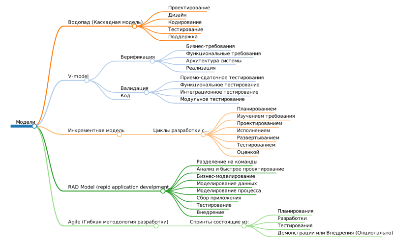

# 3-ivt-17-t2
Тема 2. 3ИВТ/17

# Инвариантная СР (ИСР)

### 2.1. Создание интеллект-карты на тему «Программная инженерия. Модели и методологии разработки» (выделение подсистем и связей между ними).

### 2.2. Создание дизайн-макета программного продукта для одного из предложенных вариантов (игра для смартфона или браузера) или собственного продукта, согласованного с преподавателем.

Создал сайт по продаже услуг по 3D-моделированию: [https://nikitapo.github.io/23degree/](https://nikitapo.github.io/23degree/)

### 2.3. Создание презентации-глоссария на тему «Гибкая методология SCRUM» средствами веб-технологий HTML, CSS, JS (Web-based slideshow) и оформление его в виде веб-сайта с использованием сервиса GitHub Pages.

[https://nikitapo.github.io/scrum-presentation/](https://nikitapo.github.io/scrum-presentation/)

# Вариативная СР (ВСР)

### 2.1. Создание прототипа технического задания программного продукта. По результатам создать отчет в репозитории GitHub, оформить его с использованием разметки Markdown 

[https://docs.google.com/document/d/16-ZZgq8LdBkFTYvcRQccT2L-Oo06Gry_ZBO29_oyC-k/edit?usp=sharing](https://docs.google.com/document/d/16-ZZgq8LdBkFTYvcRQccT2L-Oo06Gry_ZBO29_oyC-k/edit?usp=sharing)
